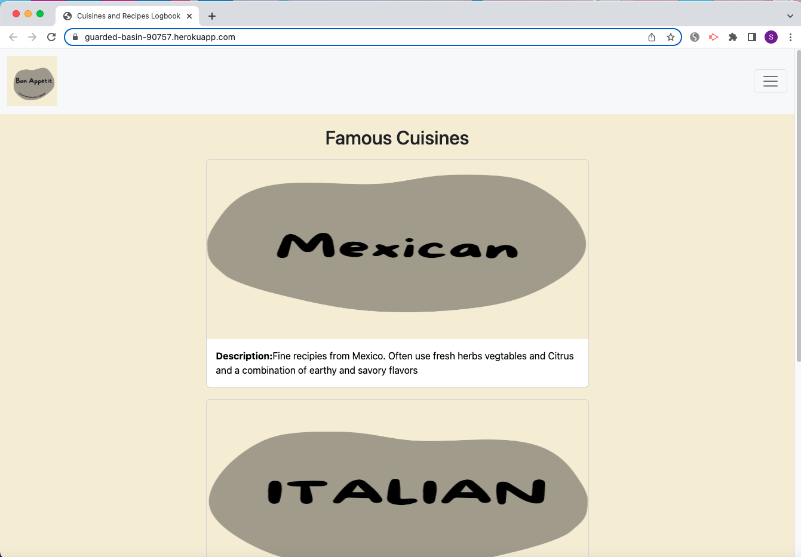
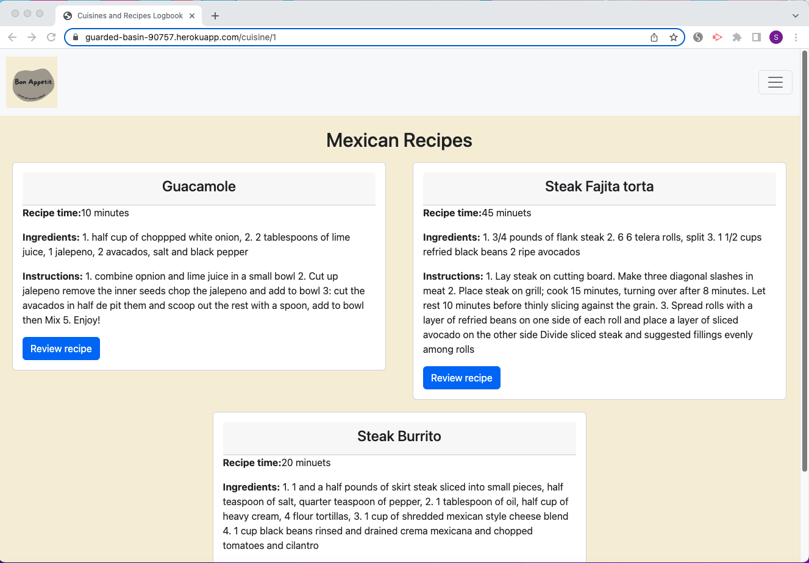
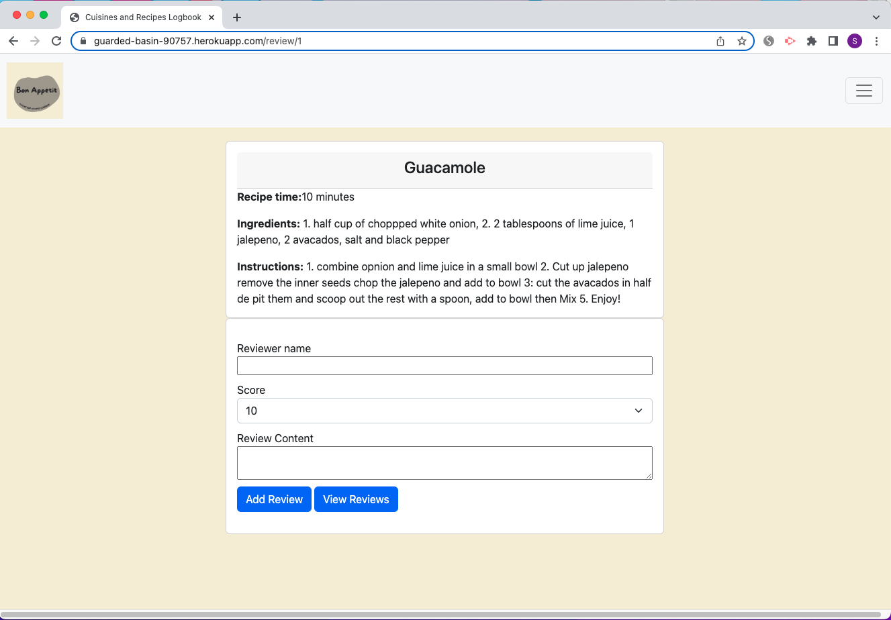
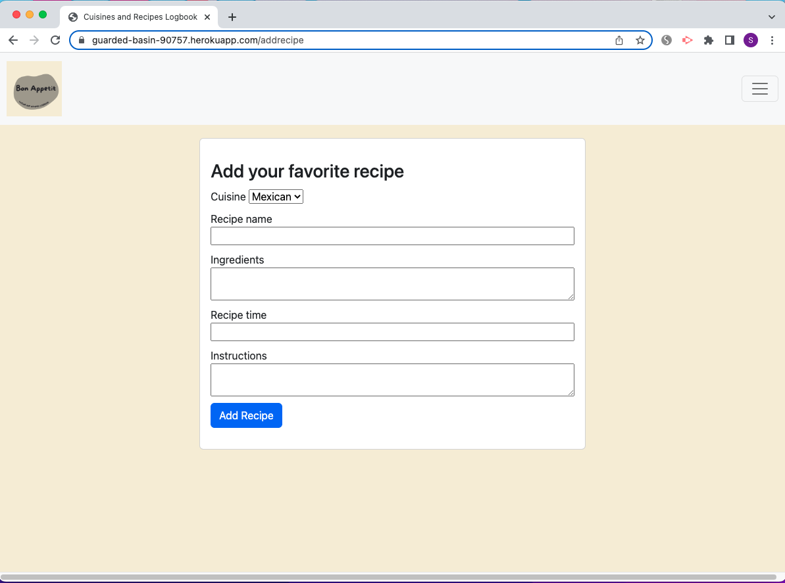

# Cuisine and recipes logbook

## Description

Our motivation for this project was to create a site with recipes from cuisines around the world. As a user of the site one can view recipes from differnet cousines. Also, you can add your favorite recipe, and leave a review for a specific recipe.

[Cuisine and recipes logbook](https://guarded-basin-90757.herokuapp.com/login)

## Installation

Please run `npm i` to install dependencies.

## Usage

1.  Run `source schema.sql` in mysql command line to use the database.
2.  Run `npm run seed` in the command line to seed the database.
3.  Run `npm start` in the command line to start the application.

## Credits

[Cortuna, Frances](https://github.com/francescortuna)

[Monica C](https://github.com/momoni0519)

[Sophia Marousis](https://github.com/marousiss)

[Burns, Nick](https://github.com/BoxLegends)

## License

N/A 